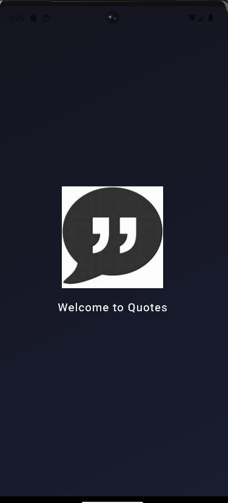
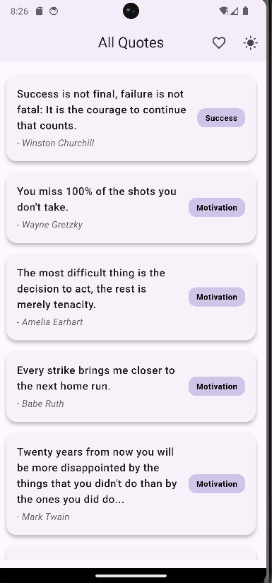
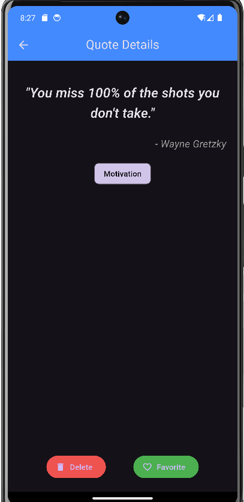
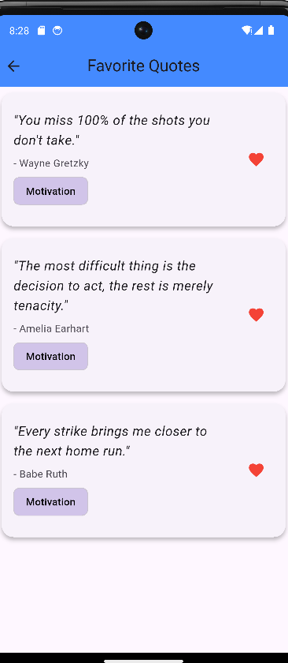

# 💬 Quotes (DB Miner)

A modern Flutter app to explore, favorite, and manage inspirational quotes — powered by SQLite and GetX for seamless performance and local storage.

---

## ✨ Features

- 📖 View categorized quotes
- ❤️ Mark/unmark favorites
- 💾 Persistent local storage using SQLite
- 🌙 Light/Dark theme toggle
- ⚡ Fast navigation & reactivity via GetX
- 🧠 JSON quote loader for first-time setup

---

🖼 Screenshots






## 🛠️ Built With

- **Flutter** & **Dart**
- **GetX** – state management & routing
- **SQLite** – local DB for offline access
- **Path Provider** – file storage access

---

## 🧩 Project Structure

lib/ ├── controllers/ # JSON data loader ├── helpers/ # Database helper (SQLite) ├── models/ # QuoteModel (data structure) ├── screens/ # UI screens (home, detail, favorite) └── main.dart # Entry point

yaml
Copy
Edit

---

## 🚀 Getting Started

### 1. Clone & Install

```bash
git clone https://github.com/your-username/quotes-db-miner.git
cd quotes-db-miner
flutter pub get
2. Run the App
bash
Copy
Edit
flutter run
📸 UI Preview
(Add screenshots here of Home, Detail, and Favorite screens)

📁 JSON Structure (Sample)
json
Copy
Edit
[
  {
    "quote": "Be yourself; everyone else is already taken.",
    "author": "Oscar Wilde",
    "category": "Inspiration"
  }
]
🧠 Smart Behavior
Quotes loaded from JSON only once into SQLite

Favorites are toggled and persisted locally

List auto-refreshes on delete or toggle

Theme updates instantly with one tap


